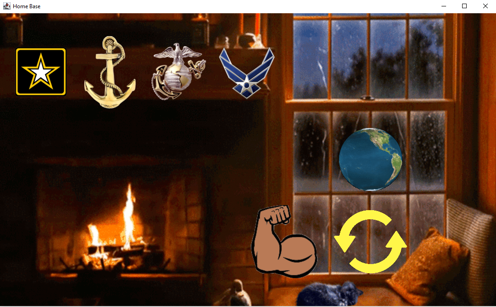
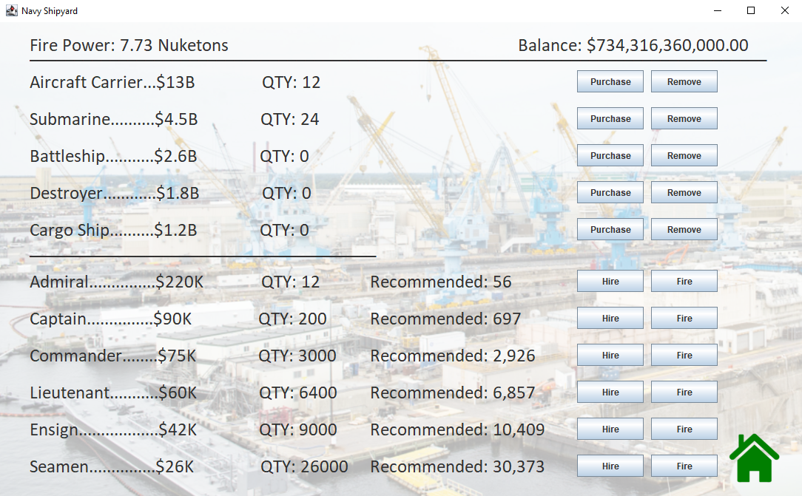
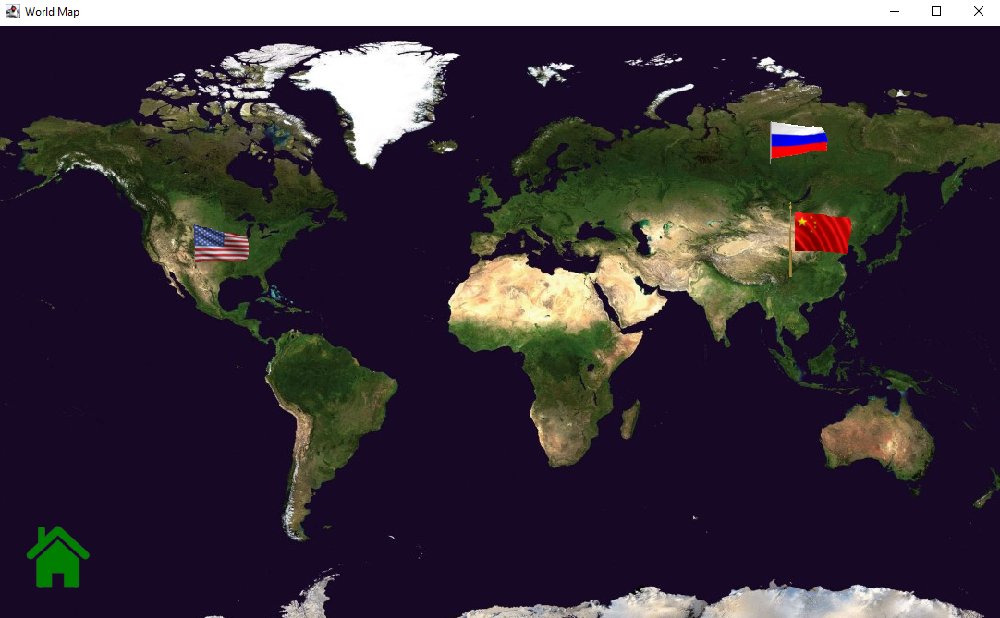

<html>
  <h1>War Simulator Game</h1>
  
A single-player war simulation game where the player has to use a limited budget to hire and maintain a military force, which they then use to fight other countries and conquer them

  <h3>Main base / game lobby</h3>
  
  <h3>Naval branch purchasing interface</h3>
  
  <h3>World map</h3>
  
</html>
